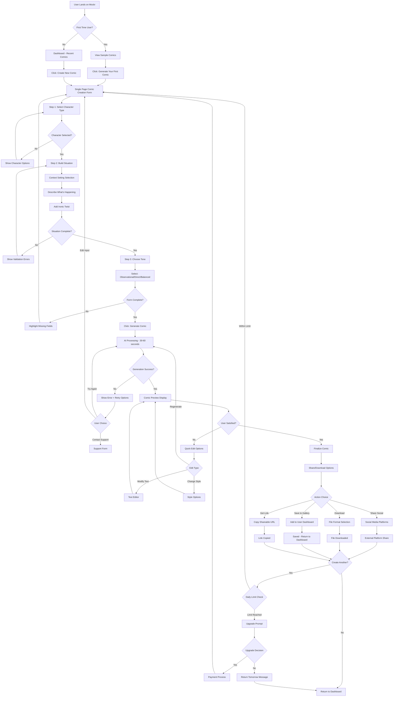
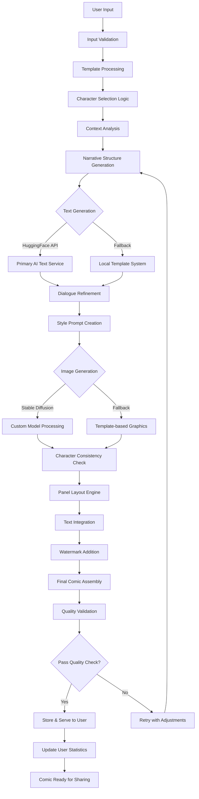

# Mockr - Product Requirements Document (PRD) v2.1
## Satirical Political Cartoon Generator - Inspired by R.K. Laxman & xkcd

---

## **1. Product Overview**

### **1.1 Product Vision**
Mockr is a web-based AI-powered platform that generates witty, satirical political cartoons in black and white caricature style, inspired by the legendary R.K. Laxman's artistic approach combined with xkcd's sharp wit. Users can create shareable content that intelligently critiques politicians, celebrities, and societal issues through consistent, brand-recognizable cartoon format.

### **1.2 Product Mission**
Democratize intelligent satirical content creation by enabling anyone to generate professional-quality, shareable political and social commentary through AI-generated cartoons that blend Laxman's calm intelligence with xkcd's irreverent humor.

### **1.3 Target Audience**
- Social media users seeking intelligent viral content
- Political commentary enthusiasts and activists
- Content creators for blogs/social platforms
- Satirical content consumers and creators
- General users wanting to express opinions through intelligent humor

---

## **2. Artistic Style & Character Design**

### **2.1 Visual Style Foundation**
- **Inspiration**: R.K. Laxman's black and white caricature style (NOT replication)
- **Format**: Clean line art, expressive faces, detailed backgrounds when needed
- **Consistency**: Once character designs are established, maintain identical visual representation across all comics
- **Color Scheme**: Strictly black and white with varying line weights for emphasis

### **2.2 Character Design Specifications**

#### **2.2.1 Common Man (Mockr Mascot)**
- **Base Design**: Inspired by Laxman's common man but uniquely designed
- **Features**: Simple clothing (checkered shirt/plain kurta), expressive face, relatable posture
- **Personality Traits**: Observant, intelligent, calm, slightly bemused by politics
- **Consistency Rule**: Identical appearance across all comics for brand recognition

#### **2.2.2 Political Figures**
- **Approach**: "Inspired by" caricatures, not direct representations
- **Style**: Exaggerated features that suggest personality traits
- **Legal Safety**: Avoid direct likeness, use archetypal politician characteristics
- **Variety**: Different body types, clothing styles, accessories to represent various political types

#### **2.2.3 Celebrities & Business Leaders**
- **Design**: Caricature style emphasizing personality over physical likeness
- **Accessories**: Symbolic items (briefcases for businessmen, microphones for celebrities)
- **Expression**: Range from smug to confused based on context

### **2.3 Artistic Standards**
- **Line Quality**: Clean, confident strokes with varying thickness
- **Backgrounds**: Minimal but effective (parliament buildings, offices, common spaces)
- **Text Integration**: Clear speech bubbles, readable fonts
- **Watermark**: "Created with Mockr" in bottom corner

---

## **3. Content Philosophy & Tone**

### **3.1 Satirical Approach**
- **R.K. Laxman Influence**: Calm, intelligent observation of political absurdity
- **xkcd Elements**: Sharp wit, unexpected perspectives, intellectual humor
- **Tone Balance**: 60% Laxman's thoughtful intelligence + 40% xkcd's irreverent wit
- **Avoidance**: Avoid crude humor, maintain sophistication in critique

### **3.2 Content Categories**
- **Political Satire**: Corruption, empty promises, bureaucratic inefficiency
- **Social Commentary**: Class disparity, modernization challenges, cultural contradictions
- **Economic Critique**: Policy impacts on common people, corporate behavior
- **International Relations**: Diplomatic absurdities, global power dynamics

---

## **4. Core Features & Functionality**

### **4.1 Comic Generation System**

#### **4.1.1 Input Template System**
```
Enhanced Template Structure: 
[CHARACTER_TYPE] + [SITUATION/CONTEXT] + [IRONIC_TWIST/OBSERVATION]

Character Types:
- Common Man (observing/commenting on situation)
- Politician (making promises/excuses)
- Bureaucrat (creating red tape/complications)
- Business Leader (pursuing profit/avoiding responsibility)
- Celebrity (virtue signaling/hypocrisy)
- International Leader (diplomatic double-speak)
```

#### **4.1.2 Enhanced Input Interface**
- **Character Selection**: Dropdown with predefined archetypes
- **Situation Builder**: 
  - Context setting (parliament, office, street, international summit)
  - Action/situation description
  - Ironic twist or observation point
- **Tone Selector**: [Laxman-style Observational, xkcd-style Sharp, Balanced Mix]
- **Panel Preference**: [Auto-decide, 2-panel, 3-panel, 4-panel, Multi-panel]

#### **4.1.3 AI-Powered Generation**
- **Text Generation**: Free tier using open-source models (initially)
- **Image Generation**: Stable Diffusion (free) for cartoon generation
- **Style Consistency**: Custom-trained model checkpoint for Mockr's unique style
- **Panel Layout**: Dynamic panel arrangement based on narrative flow

### **4.2 Free-Tier Architecture (Solo Developer Focus)**

#### **4.2.1 Free AI Tools Integration**
- **Text Generation**: 
  - Primary: Google Gemini 1.5 Flash API (15 requests/minute, 1500 requests/day free)
  - Fallback: Local template system for high-traffic scenarios
- **Image Generation**:
  - Primary: Stable Diffusion via Hugging Face Inference API (free tier)
  - Generation Time: 30-60 seconds (acceptable for MVP)
  - Style Training: Custom LoRA models for consistent character design

#### **4.2.2 Cost-Effective Hosting**
- **Frontend**: Netlify (free tier - 100GB bandwidth, 300 build minutes)
- **Backend**: Supabase Edge Functions (500K invocations/month free)
- **Database**: Supabase (500MB database free)
- **Image Storage**: Supabase Storage (1GB storage, 2GB bandwidth/month free)
- **CDN**: Supabase built-in CDN + optional Cloudflare (100GB bandwidth/month free)
- **Authentication**: Clerk (10,000 MAU free tier) with payment integration

---

## **5. UI/UX Flow Diagram & Application Workflow**

### **5.1 Overall Application Architecture Flow - User Journey Map**



### **5.2 Detailed UI Layout Specifications**

#### **5.2.1 Landing Page Layout**
```
┌─────────────────────────────────────────────────────────────┐
│                         HEADER                              │
│  [MOCKR LOGO] [Nav: Home|Gallery|About] [Login|Sign Up]     │
├─────────────────────────────────────────────────────────────┤
│                      HERO SECTION                          │
│           "Create Intelligent Political Satire"            │
│              [Generate Your First Comic]                   │
│                                                             │
│         [Sample Comic 1] [Sample Comic 2] [Sample Comic 3] │
├─────────────────────────────────────────────────────────────┤
│                    TRENDING COMICS                         │
│           [Popular comics from other users]                │
├─────────────────────────────────────────────────────────────┤
│                       FOOTER                               │
│            [Social Links] [Terms] [Privacy]                │
└─────────────────────────────────────────────────────────────┘
```

#### **5.2.2 Comic Creation Form - Single Page (Progressive Disclosure)**

**Single Page Form with Collapsible Sections (Current Trend)**
```
┌─────────────────────────────────────────────────────────────┐
│  [← Back]              Create Your Comic                    │
├─────────────────────────────────────────────────────────────┤
│                                                             │
│  1️⃣ CHARACTER TYPE                                         │
│  ┌─────────────────────────────────────────────────────────┐│
│  │ Select Character: [Dropdown ▼]                          ││
│  │ ├─ Common Man                                           ││
│  │ ├─ Politician                                           ││
│  │ ├─ Business Leader                                      ││
│  │ ├─ Celebrity                                            ││
│  │ ├─ Bureaucrat                                           ││
│  │ └─ International Leader                                 ││
│  └─────────────────────────────────────────────────────────┘│
│                                                             │
│  2️⃣ SITUATION BUILDER                                      │
│  ┌─────────────────────────────────────────────────────────┐│
│  │ Context Setting: [Dropdown ▼]                           ││
│  │ ├─ Parliament      ├─ Office        ├─ TV Studio       ││
│  │ ├─ Street          ├─ Conference    └─ Other           ││
│  │                                                         ││
│  │ What is happening? (200 chars max)                      ││
│  │ ┌─────────────────────────────────────────────────────┐ ││
│  │ │ Making promises about healthcare reform...          │ ││
│  │ └─────────────────────────────────────────────────────┘ ││
│  │                                                         ││
│  │ What's the ironic twist? (200 chars max)                ││
│  │ ┌─────────────────────────────────────────────────────┐ ││
│  │ │ While owning pharmaceutical company stocks...       │ ││
│  │ └─────────────────────────────────────────────────────┘ ││
│  │                                                         ││
│  │ Quick Templates:                                        ││
│  │ [Corruption] [Empty Promises] [Hypocrisy] [Bureaucracy] ││
│  └─────────────────────────────────────────────────────────┘│
│                                                             │
│  3️⃣ TONE SELECTION                                         │
│  ┌─────────────────────────────────────────────────────────┐│
│  │ Choose satirical tone:                                  ││
│  │ ○ Observational  ○ Direct  ○ Balanced                  ││
│  │                                                         ││
│  │ Panel count: Auto-decide (AI will determine optimal)    ││
│  └─────────────────────────────────────────────────────────┘│
│                                                             │
│  ┌─────────────────────────────────────────────────────────┐│
│  │           🎨 GENERATE COMIC (30-60 seconds)             ││
│  └─────────────────────────────────────────────────────────┘│
│                                                             │
│  Daily Limit: 2/3 comics remaining (Free Plan)             │
└─────────────────────────────────────────────────────────────┘
```

### **5.3 Generation Process Flow**

#### **5.3.1 AI Processing Interface**
```
┌─────────────────────────────────────────────────────────────┐
│                 🤖 Creating Your Comic                      │
├─────────────────────────────────────────────────────────────┤
│                                                             │
│  ┌─────────────────────────────────────────────────────────┐│
│  │ ████████████████████░░░░░░░░ 65%                       ││
│  └─────────────────────────────────────────────────────────┘│
│                                                             │
│  Current Step: Generating dialogue and narrative...         │
│                                                             │
│  Process Steps:                                             │
│  ✅ Analyzing input parameters                              │
│  ✅ Creating story structure                                │
│  🔄 Generating dialogue and narrative                       │
│  ⏳ Creating character artwork                              │
│  ⏳ Composing final panels                                  │
│  ⏳ Adding speech bubbles and text                          │
│                                                             │
│  [Cancel Generation]                                        │
│                                                             │
│  💡 Tip: Great political satire often finds humor in the   │
│     gap between what politicians say and what they do.     │
└─────────────────────────────────────────────────────────────┘
```

#### **5.3.2 Comic Preview & Edit Interface**
```
┌─────────────────────────────────────────────────────────────┐
│  [← Create New]       Your Comic is Ready!        [Share →] │
├─────────────────────────────────────────────────────────────┤
│                                                             │
│  ┌─────────────────────────────────────────────────────────┐│
│  │                  GENERATED COMIC                        ││
│  │                                                         ││
│  │  [Panel 1]           [Panel 2]           [Panel 3]      ││
│  │  [Comic image displayed here - responsive sizing]       ││
│  │                                                         ││
│  │                                                         ││
│  │               "Created with Mockr" watermark            ││
│  └─────────────────────────────────────────────────────────┘│
│                                                             │
│  Quick Edits:                                               │
│  ┌─────────────────────────────────────────────────────────┐│
│  │ [Edit Text] [Regenerate] [Change Style] [Add Panel]     ││
│  └─────────────────────────────────────────────────────────┘│
│                                                             │
│  ┌─────────────────────────────────────────────────────────┐│
│  │    [🔄 Regenerate]  [💾 Save]  [📤 Share]  [⬇️ Download] ││
│  └─────────────────────────────────────────────────────────┘│
└─────────────────────────────────────────────────────────────┘
```

### **5.4 Sharing Interface Design**
```
┌─────────────────────────────────────────────────────────────┐
│  [← Back to Comic]        Share Your Creation               │
├─────────────────────────────────────────────────────────────┤
│                                                             │
│  ┌─────────────────────────────────────────────────────────┐│
│  │                [Comic Thumbnail]                        ││
│  └─────────────────────────────────────────────────────────┘│
│                                                             │
│  Share on Social Media:                                     │
│  ┌─────────────────────────────────────────────────────────┐│
│  │ [📘 Facebook] [🐦 Twitter] [📷 Instagram] [💼 LinkedIn] ││
│  │ [📱 WhatsApp] [💬 Telegram] [📌 Pinterest] [🤖 Reddit]  ││
│  └─────────────────────────────────────────────────────────┘│
│                                                             │
│  Share Options:                                             │
│  ┌─────────────────────────────────────────────────────────┐│
│  │ 📋 Copy Link: [mockr.com/comic/abc123] [Copy]           ││
│  │ 📧 Email: [Share via email]                            ││
│  │ 🔗 Embed: [Get embed code for websites]                ││
│  └─────────────────────────────────────────────────────────┘│
│                                                             │
│  Download Options:                                          │
│  ┌─────────────────────────────────────────────────────────┐│
│  │ [⬇️ High Resolution PNG] [⬇️ Web Optimized JPG]         ││
│  │ [⬇️ Print Ready PDF] [⬇️ Social Media Optimized]        ││
│  └─────────────────────────────────────────────────────────┘│
└─────────────────────────────────────────────────────────────┘
```

### **5.5 User Dashboard/Gallery**
```
┌─────────────────────────────────────────────────────────────┐
│  [MOCKR LOGO]  My Comics  [🎨 Create New Comic]  [Profile ▼]│
├─────────────────────────────────────────────────────────────┤
│                                                             │
│  My Recent Comics:                                          │
│  ┌─────────────────────────────────────────────────────────┐│
│  │ [Comic 1]    [Comic 2]    [Comic 3]    [Comic 4]       ││
│  │ [thumbnail]  [thumbnail]  [thumbnail]  [thumbnail]      ││
│  │ 2 days ago   1 week ago   2 weeks ago  1 month ago     ││
│  │ [Share][Edit][Share][Edit][Share][Edit][Share][Edit]    ││
│  └─────────────────────────────────────────────────────────┘│
│                                                             │
│  Statistics:                                                │
│  ┌─────────────────────────────────────────────────────────┐│
│  │ Comics Created: 12    Total Shares: 45    Views: 234   ││
│  │ Daily Limit: 2/3 remaining                             ││
│  └─────────────────────────────────────────────────────────┘│
│                                                             │
│  Popular Templates:                                         │
│  ┌─────────────────────────────────────────────────────────┐│
│  │ [Quick Create: Politician Promises] [Bureaucracy Humor] ││
│  │ [Corporate Hypocrisy] [Celebrity Virtue Signaling]      ││
│  └─────────────────────────────────────────────────────────┘│
└─────────────────────────────────────────────────────────────┘
```

### **5.6 Application Backend Processing Flow**

#### **5.6.1 Technical Workflow**


#### **5.6.2 Data Storage Structure**
```javascript
// Comic Data Model
{
  id: "comic_abc123",
  userId: "user_xyz789",
  timestamp: "2025-09-16T10:30:00Z",
  input: {
    characterType: "politician",
    context: "parliament",
    situation: "making healthcare promises",
    twist: "while owning pharma stocks",
    tone: "balanced",
    panels: "auto"
  },
  generated: {
    narrative: "structured story data",
    dialogue: ["panel 1 text", "panel 2 text", "panel 3 text"],
    imageUrl: "https://storage.mockr.com/comics/abc123.png",
    panelCount: 3,
    style: "laxman-balanced"
  },
  metadata: {
    generationTime: 42.3,
    aiModel: "stable-diffusion-mockr-v1",
    shares: 0,
    views: 0,
    public: true
  }
}
```

### **5.7 Mobile Responsiveness Flow**

#### **5.7.1 Mobile Layout Adaptations**
```
Mobile Comic Creation (Vertical Stack):
┌─────────────────────┐
│      MOCKR LOGO     │
├─────────────────────┤
│   Step 1: Character │
│   [Character Grid]  │
│   [2x3 layout]      │
├─────────────────────┤
│   [Selected: Pol.]  │
│   [Next Button]     │
├─────────────────────┤
│   Step 2: Situation │
│   [Context Buttons] │
│   [Text Input]      │
│   [Template Chips]  │
├─────────────────────┤
│   [Next Button]     │
└─────────────────────┘
```

### **5.8 Error Handling & User Feedback**

#### **5.8.1 Error States Design**
```
Generation Failed State:
┌─────────────────────────────────────────────────────────────┐
│                   ⚠️ Generation Failed                      │
├─────────────────────────────────────────────────────────────┤
│                                                             │
│  We couldn't generate your comic right now.                 │
│                                                             │
│  Possible reasons:                                          │
│  • High server load (try again in a few minutes)           │
│  • Content didn't pass our guidelines                      │
│  • Technical issue with AI service                         │
│                                                             │
│  ┌─────────────────────────────────────────────────────────┐│
│  │ [🔄 Try Again] [✏️ Edit Input] [💬 Contact Support]     ││
│  └─────────────────────────────────────────────────────────┘│
│                                                             │
│  [← Back to Creation] [🏠 Home]                             │
└─────────────────────────────────────────────────────────────┘
```

---

## **6. Technical Architecture (Free-Tier Optimized)**

### **6.1 Frontend Stack**
- **Framework**: React.js with Next.js (free deployment on Vercel)
- **UI Library**: Tailwind CSS (free)
- **State Management**: React Context (no additional cost)
- **Icons**: Lucide React (free)
- **PWA**: Service Worker for offline capability prep

### **6.2 Backend Architecture**
- **Server**: Supabase Edge Functions (serverless, 500K invocations/month free)
- **Database**: Supabase PostgreSQL (500MB free tier)
- **Authentication**: Clerk (10,000 MAU free tier) with integrated payment processing
- **Image Processing**: Sharp.js in Edge Functions for optimization
- **Rate Limiting**: Built-in Supabase rate limiting + custom logic

### **6.3 AI Integration (Free-Tier Strategy)**
```javascript
// Example free-tier AI integration approach
const generateText = async (prompt) => {
  try {
    // Primary: Hugging Face Inference API (free tier)
    const response = await fetch('https://api-inference.huggingface.co/models/google/flan-t5-large', {
      method: 'POST',
      headers: { 'Authorization': `Bearer ${process.env.HF_TOKEN}` },
      body: JSON.stringify({ inputs: prompt })
    });
    return response.json();
  } catch (error) {
    // Fallback to local processing or simple template system
    return generateFallbackText(prompt);
  }
};
```

### **6.4 Custom Model Training**
- **Character Consistency**: Train Stable Diffusion LoRA for Mockr characters
- **Style Transfer**: Custom checkpoint for R.K. Laxman inspired style
- **Training Data**: Curated dataset of political cartoon styles (legally sourced)

---

## **7. Content Examples & Templates**

### **7.1 Laxman-Inspired Templates**
```
"Politician [promises employment for all] [while automation eliminates jobs]"
"Bureaucrat [simplifies procedures] [creates 15 new forms to fill]"
"Common Man [reads about economic growth] [while prices double]"
"International Leader [talks about climate action] [from air-conditioned mega-mansion]"
```

### **7.2 Panel Structure Examples**
- **2-Panel**: Setup → Punchline
- **3-Panel**: Setup → Complication → Ironic Resolution
- **4-Panel**: Context → Promise → Reality → Common Man's Observation
- **Multi-Panel**: Complex political situations with build-up

---

## **8. Content Moderation & Safety**

### **8.1 Automated Filtering (No Manual Moderation)**
- **Text Screening**: Gemini API built-in safety filters + automated profanity detection
- **Context Analysis**: AI-powered political criticism vs. personal attack differentiation
- **Image Validation**: Automated NSFW detection using open-source models
- **Legal Protection**: Automated checks to avoid direct character likeness
- **Real-time Processing**: All content filtered during generation, not post-creation

### **8.2 Automated Quality Control**
- **Style Consistency**: Automated character design validation using image recognition
- **Readability**: Automated text size and clarity validation
- **Brand Standards**: Automated watermark and style guide enforcement
- **Content Guidelines**: Automated rejection of inappropriate content with user feedback

---

## **9. Monetization Strategy (Future Implementation)**

### **9.1 Freemium Evolution**
- **Phase 1**: Free with watermarks and daily limits
- **Phase 2**: Optional premium features ($2.99/month)
  - Watermark removal
  - Custom character creation
  - Higher resolution downloads
  - Priority generation queue

### **9.2 Revenue Diversification**
- **Print-on-Demand**: Political cartoon merchandise
- **Licensing**: Comic strips for blogs/publications
- **Custom Creation**: Personalized political cartoons for special events

---

## **10. Success Metrics**

### **10.1 Key Performance Indicators**
- **User Engagement**: Daily active comic creators
- **Content Quality**: User satisfaction with generated comics
- **Social Impact**: Share rates and viral coefficient
- **Technical Performance**: Generation speed and success rate
- **Style Consistency**: Character recognition across comics

### **10.2 Quality Benchmarks**
- **Generation Time**: <45 seconds per comic
- **Style Consistency**: 95% character recognition rate
- **User Satisfaction**: >4.2/5 rating for generated content
- **Technical Reliability**: 99% uptime, <2% generation failures

---

## **11. Legal & Compliance**

### **11.1 Intellectual Property Protection**
- **Original Style**: Inspired by but not copying Laxman's work
- **Character Design**: Unique Mockr character archetypes
- **Content Disclaimer**: "Satirical content for entertainment purposes"
- **Fair Use**: Political satire protection under free speech

### **11.2 Platform Policies**
- **Social Media Compliance**: Content suitable for all major platforms
- **Regional Sensitivity**: Avoid content that might be problematic in specific regions
- **User Agreement**: Clear terms about generated content ownership

---

## **12. Solo Developer Considerations**

### **12.1 Development Efficiency**
- **Code Reusability**: Modular architecture for easy maintenance
- **Documentation**: Comprehensive code documentation for future scaling
- **Testing Strategy**: Automated testing for critical generation pipeline
- **Deployment**: CI/CD pipeline for seamless updates

### **12.2 Resource Management**
- **Free Tier Monitoring**: Track usage against free limits
- **Performance Optimization**: Efficient caching and image compression
- **Scalability Planning**: Architecture ready for paid service migration
- **Community Building**: User feedback integration for organic growth

---

**Document Version**: 2.1  
**Last Updated**: September 16, 2025  
**Status**: Ready for ClaudeCode Implementation  
**Key Changes**: Added comprehensive UI/UX flow diagrams, detailed application workflow, removed development roadmap, R.K. Laxman inspiration integration, free-tier optimization